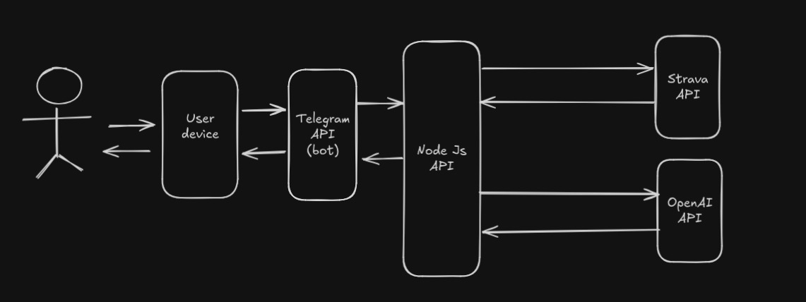
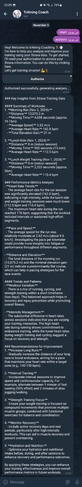

This project is an integration of my strava data, openAI API and telegram API to fetch my training data
and use the openAI API to proccess my training data and generate insights from my trainings.

This is just an MVP at this moment, but in the future it possibly can become a complete AI coach as soon it receives
enough to training the model with training data from me.

Flow example:

Result example:

